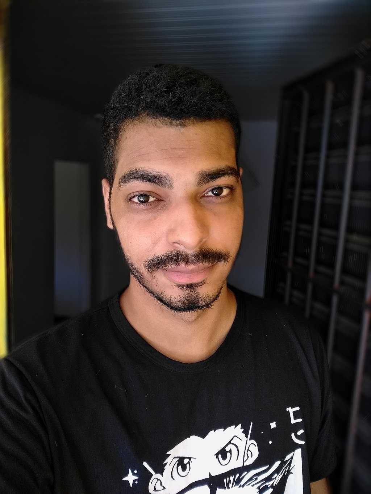

# 

O BUMP é um projeto desenvolvido para auxiliar nas organizações de atividades a serem feitas, podendo-as reunir em apenas um lugar. Contém uma interface limpa e de fácil uso, além de possuir um chat no qual o usuario pode interagir com outros membros que estão nos mesmos grupos de atividade que o usuario.

<h4 align="center"> 
    :construction:  Projeto em construção  :construction:
</h4>

## :hammer: Funcionalidades do BUMP

- `Funcionalidade 1`: Criar uma conta de usuario e fazer Login
- `Funcionalidade 2`: Entrar na home onde aparece todos os grupos de atividade em que o usuario logado está
- `Funcionalidade 3`: Pode criar novos grupos ou entrar nos grupos ja existentes
- `Funcionalidade 4`: Ao entrar no grupo  é mostrado para os membros presentes, as tasks e o chat
- `Funcionalidade 5`: Em cada task pode ser adicionado subtasks e marcadas como concluidas pelos membros que a fizeram!

## 📁 Acesso ao projeto

### https://bump-henriqueyujiandrade.vercel.app/

## 💻 Tecnologias Utilizadas

- `Funcionalidade 1`: React 
- `Funcionalidade 2`: Vercel 
- `Funcionalidade 3`: Tostify
- `Funcionalidade 4`: Axios
- `Funcionalidade 5`: Router Dom
- `Funcionalidade 6`: Chakra 
- `Funcionalidade 7`: Framer-motion
- `Funcionalidade 8`: Uuid
- `Funcionalidade 9`: Styled Components

## Desenvolvedores 

| [ Yasmin](https://www.linkedin.com/in/devyasmin/) | [ Valmir](https://github.com/camilafernanda) | [ Maykon](https://github.com/camilafernanda) | [ João Victor](https://github.com/camilafernanda) | [ Guilherme Lima](https://github.com/guilhermeonrails) |  [ Henrique](https://www.linkedin.com/in/henriqueyujiandrade/) |
| :---: | :---: | :---: | :---: | :---: | :---: |
